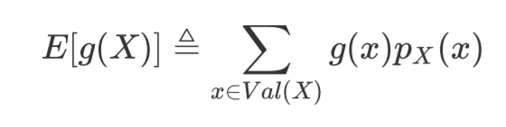
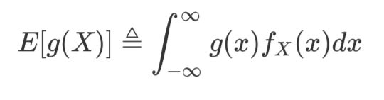
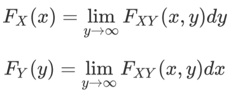
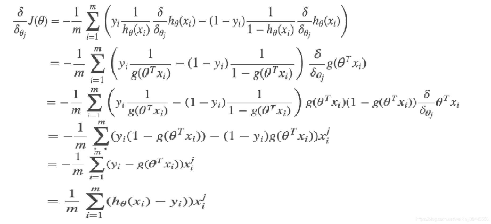
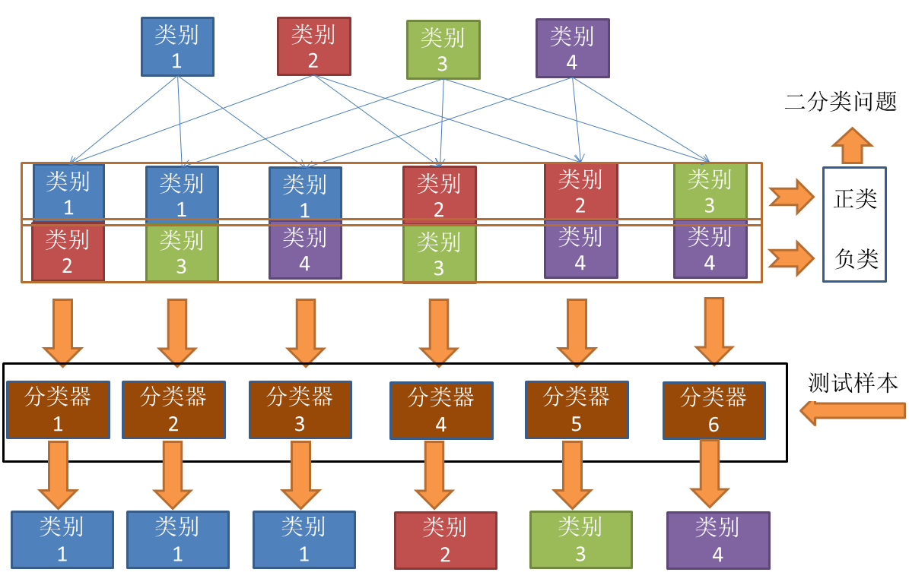
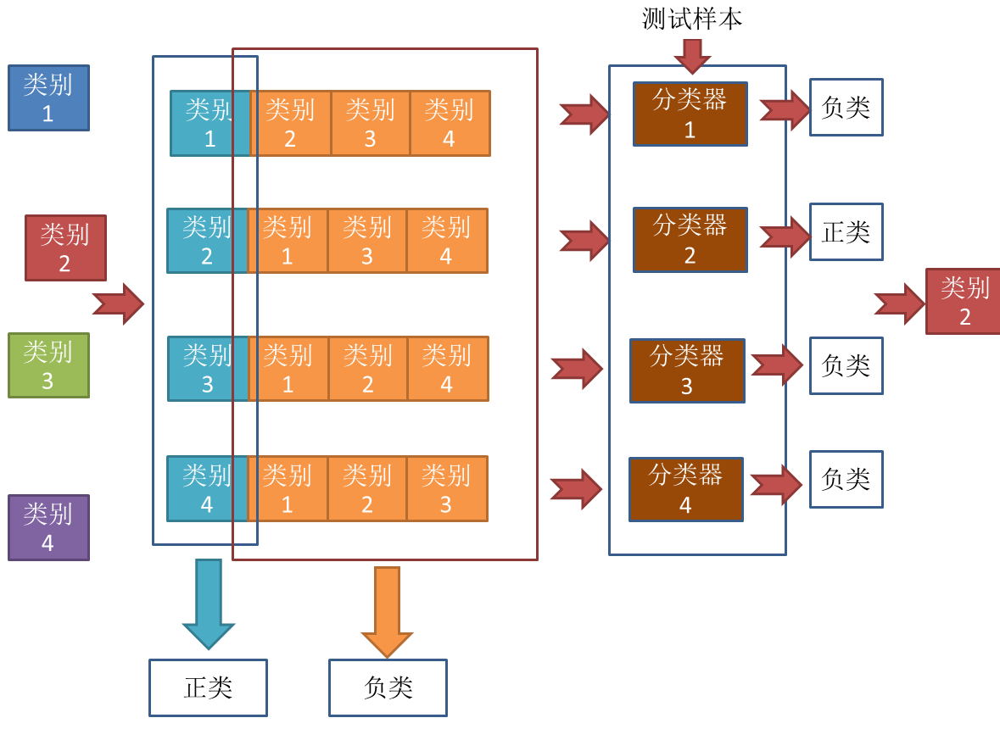
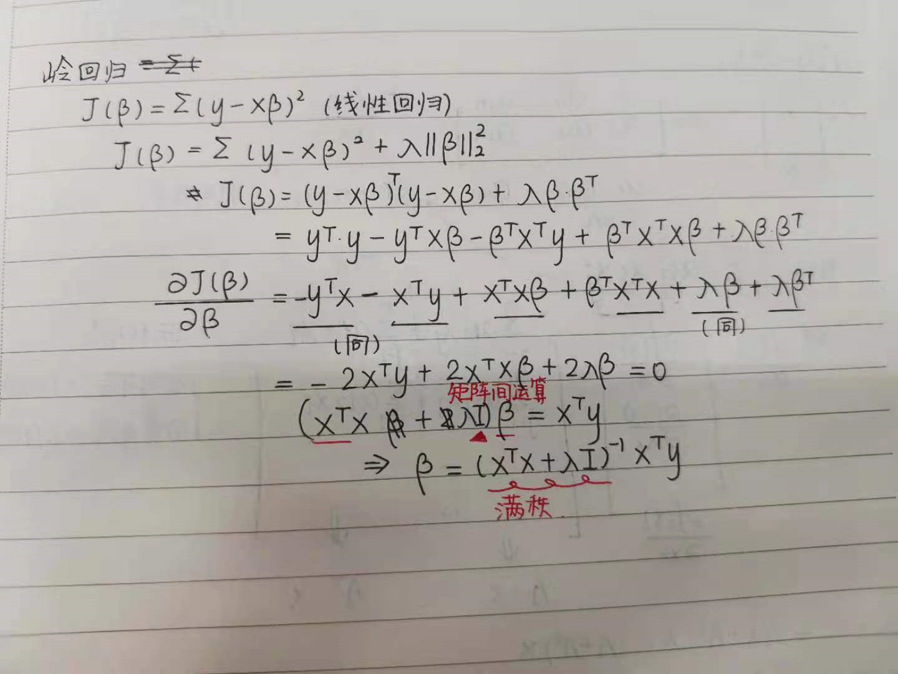

# 模型的评估与选择

## 留出法（hold-out)

直接讲数据集D划分为两个互斥的集合，一个集合作为训练集S，另一个作为测试集T

分层采样：保留类别比例的采样方式

采用若干次随机划分、重复实验评估后取平均值作为留出法的评估结果

## 交叉验证法（cross balidation K折交叉验证）

将数据集划分为k个大小相同的互斥子集，每次用k-1个子集的并集作为训练集，余下的那个子集作为测试集，这样可以获得k组训练/测试集，从而可进行k次训练和测试，最终返回的是这k个测试结果的均值。

### 留一法（交叉验证特例）

假定数据集D中包含m个样本，令k = m

留一法不受随机样本划分方式的影响

## 自助法（bootstrapping）

### 自助采样

每次随机从D中挑选一个样本，将其拷贝放入D‘，然后再将该样本放回初始数据集D中，使得该样本在下次采样时仍有可能被采到；这个过程重复执行m次后，得到包含m个样本的数据集D’

将D‘用作训练集，D\D'用作测试集

### 外包估计

实际评估的模型和期望估计的模型都使用m个样本用于测试，这样的测试结果亦称“外包估计”

## 性能度量

衡量模型泛化能力的评价标准

**Bias**(偏差)

是用**所有可能的训练数据集**训练出的**所有模型**的输出的**平均值**与**真实模型**的输出值之间的差异。
$$
bias^2(x)=({f(\bar{x})}-y)^2
$$
**偏差度量了学习算法的期望预测与真实结果的偏离程度，即刻画了学习算法本身的拟合能力。**

**Variance**（方差）

是**不同的训练数据集训练出的模型**输出值之间的差异。
$$
var(x)=E_D[(f(x,D)-\bar{f}(x))^2]
$$
**方差度量了同样大小的训练集的变动所导致的学习性能的变化，即刻画了数据扰动所造成的影响。**

泛化误差=错误率=
$$
bias^2(x)+bar(x)+\varepsilon^2
$$

### 均方误差(MSE)

$$
E(f;D) = \frac{1}{m}\sum_{i=1}^{m}(f(x_{i})-y_{i})^2
$$

### 均方根误差（RMSE）

$$
\sqrt{\frac{1}{m}\sum_{i=1}^{m}(f(x_{i})-y_{i})^2}
$$

### 平均绝对误差(MAE)

$$
\frac{1}{m}|{\sum_{i=1}^{m}(f(x_{i})-y_{i})}|
$$

### 错误率与精度

错误率
$$
E(f:D) =\frac{1}{m}\sum_{i=1}^{m}\|(f(x_i)\neq{y_i})
$$
准确率（精度）
$$
acc(f;D)=1-E(f;D)
$$

$$
ACC=\frac{TP+TN}{TP+TN+FP+FN}
$$

### 查准率、查全率与F1

真正例(TP),假正例(FP),真反例(TN),假反例(FN)

查准率P：检索中的信息有多少比例时用户感兴趣的

又称精确率，针对预测结果而言

(预测正例中预测正确的比例)
$$
P =\frac{TP}{TP+FP}
$$
查全率R:用户感兴趣的信息中有多少被检索出来

又称召回率，针对原来的样本而言
$$
R=\frac{TP}{TP+FN}
$$
(真实正例中预测正确的比列)

若一个学习器的P-R曲线被另一个学习器的曲线完全“包住”，则可断言后者的性能优于前者

#### 查准率、查全率性能度量

1）平衡点

查准率=查全率

2）F1度量
$$
F1=\frac{2{\times}P{\times}R}{P+R}=\frac{2{\times}TP}{样例总数+TP-TN}
$$

$$
\frac{2}{F1}=\frac{1}{P}+\frac{1}{R}
$$

### ROC与AUC

ROC(受试者工作特征)

真正例率

(真实正例中预测正确的)
$$
TPR = \frac{TP}{TP+FN}
$$
假正例率

(真实假例中预测正确的)
$$
FPR=\frac{FP}{TN+FP}
$$
AUC:

ROC曲线下的面积
$$
AUC=\frac{1}{2}\sum_{i=1}^{m-1}(x_{i+1}-x_i)(y_i+y_{i+1})(梯形面积)
$$

# 数学理论基础

## 线性代数

### 矩阵求导

$$
本质：\frac{dA}{dB}:矩阵A中的每一个元素对矩阵B中的每一个元素求导
$$

求导秘术-YX拉伸

1）标量不变，向量拉伸

2）（Y)前面横向拉，(X)后面纵向拉

## 概率论

### 条件概率与独立性

B事件发生的情况下A事件的发生概率
$$
P(A|B)\triangleq{\frac{P(A\cup{B})}{P(B)}}
$$

### 累积分布函数 (CDF)

（离散型）

是函数
$$
F_x:R→[0,1]
$$
它将概率度量指定为
$$
F_X(x)=P(X\leqslant{x})
$$
能完整描述一个实随机变量*X*的概率分布

### 概率质量函数(PMF)

（连续型）

**概率质量函数**是离散随机变量在各特定取值上的概率
$$
p_X:\Omega→R， p_X(x)=P(X=x)
$$

### 概率密度函数(PDF)

对于**一些**连续随机变量，累积分布函数处处可微，则概率密度函数定义为累积分布函数的导数
$$
f_X(x)=\frac{dF_X(x)}{dx}
$$

### 期望

#### 离散随机变量

#### 连续性随机变量

### 极大似然估计(最大似然估计)

核心思想：使样本获得最大概率的参数值作为未知参数估计值

#### 似然函数

1）连续型：密度函数

2）离散型：概率

#### 求极大似然函数估计值的一般步骤

（1） 写出似然函数；

（2） 对似然函数取对数，并整理；

（3） 求导数 ；

（4） 解似然方程 。

### 协方差

衡量两个变量的总体误差（两个变量总体误差的期望）
$$
Cov(X,Y)=E[(X-E(X))(Y-E(Y))]=E[XY]-E[X]E[Y]
$$

$$
Cov(X,Y)=E[(X-\mu_x)(Y-\mu_y)]
$$

X值与其均值之差乘以Y值与其均值之差，再对每时刻的乘积求和并求出均值（求期望）

### 方差

$$
Var[X]=E[(X-E(x))^2]=E[X^2]-E[X]^2
$$

### 常见随机变量

#### 离散随机变量

伯努利分布

二项式分布

几何分布

泊松分布

#### 连续随机变量

均匀分布

指数分布

正态分布

### 联合分布和边缘分布

联合累积分布函数
$$
D_{XY}(x，y)=P(X<=x,Y<=y)
$$
边缘累积概率分布函数

# 线性模型

## 线性回归

基本形式
$$
y=\omega^Tx+b
$$
目标：使损失函数尽可能小
$$
J(\omega,b)=\sum_{i=1}^{m}(f(x_i)-y_i)
$$
分别对omega和b求导，并令两式等于0
$$
b=\frac{1}{m}\sum_{i=1}^{m}(y_i-\omega{x_i})=\bar{y}-\omega\bar{x}
$$

$$
\omega=\frac{\sum_{i=1}^{m}y_i(x_i-\bar{x})}{\sum_{i=1}^{m}x_i^2-\frac{1}{m}(\sum_{i=1}^{m}x_i)^2}=\frac{\sum_{i=1}^{m}(x_iy_i-\bar{x}y_i)}{\sum_{i=1}^{m}(x_i^2-\bar{x}^2)}
$$

进行向量化处理可得多元线性回归的正规方程解
$$
\omega=(X^TX)^{-1}X^Ty
$$

对数形式
$$
\ln{y}=\omega^Tx+b
$$
广义形式
$$
y = g^{-1}(\omega^Tx+b)
$$
(g(.)称为联系函数,即g(y)和x是线性关系)
$$
g(y)=\omega^Tx+b
$$

$$
y=g^{-1}(\omega^Tx+b)
$$

## 逻辑回归（对数几率回归）

用回归的思想做分类问题

sigmod函数
$$
g(z)=\frac{1}{1+e^{-z}}
$$

$$
z = W^TX
$$

函数形式表达

P(y = 0 | w,x) = 1 – g(z)                         P(y = 1 | w,x) =  g(z)
$$
P(正确)=(g(\omega,x_i))^{y^i}*(a-g(\omega,x_i))^{1-y^i}
$$
y^i为某一条样本的预测值,取值范围为0或者1，令
$$
h_\theta(x)=\frac{1}{1+e^{-z}}
$$
似然函数

$$
L(\theta)=\prod_{i=1}^{m}(h_\theta(x^{(i)}))^{y(i)}(1-h\theta(x^{(i)}))^{1-y^{(i)}}
$$
根据步骤来，取对数
$$
l(\theta)=logL(\theta)=\sum_{i=1}^{m}(y^{(i)}logh_{\theta}(x^{(i)})+(1-y^{i})log(1-h_{\theta}(x^{(i)}))
$$
得到的这个函数越大,证明我们得到的W就越好.因为在函数最优化的时候习惯让一个函数越小越好,所以我们在前边加一个负号。得到公式如下:
$$
J_{log}(w)=\sum_{i=1}^{m}-y_ilog(p(x_i;w))-(1-y_i)log(1-p(x_i;w))
$$
（交叉熵损失函数）

求解损失函数使用梯度下降

## 梯度下降

公式中的alpha叫做学习率，让点沿着梯度方向下降慢慢求得最优解的过程我们叫做学习，学习率就是用来限制他每次学习别太过"用功"的
$$
\theta_k=\theta_{k-1}-\alpha*g
$$

## 多分类学习

### 一对一（OvO）

将N个类别进行两两配对，可得到
$$
\frac{N(N-1)}{2}
$$
个分类器，把预测得最多的类别作为最终分类结果

### 一对其余（OvR）

每次将一个类别作为正类，其余类别作为负类，在测试时若仅有一个分类器预测为正类，则对应的类别标记作为最终结果；若有多个分类器预测为正类，则通常考虑分类器的预测置信度，选择置信度最大的类别标记作为分类结果

### 多对多（MvM）

每次将若干个类作为正类，若干个其他类作为反类

#### 纠错输出码（ECOC）

编码：对N个类别做M次划分，每次划分将一部分类别划为正类，一部分划为反类，从而形成一个二分类训练集。这样一共产生M个训练集，可训练出M个分类器

解码：M 个分类器分别对测试样本进行预测，这些**预测标记**组成一个编码。将这个预测编码与每个类别各自的编码进行比较，返回其中**距离最小**的类别作为最终预测结果

#### 编码矩阵

二元码

三元码

## 类别不平衡问题

### 再缩放(再平衡)

$$
\frac{y'}{1-y'}=\frac{y}{1-y}\times\frac{m^+}{m^-}
$$

同时也是代价敏感学习的基础

### 欠采样

去除一些反例是的正、反例数目接近

代表算法：SMOTE，通过对训练集里的正例进行插值产生额外正例

### 过采样

增加一些正例使得正、反例数目接近

代表算法：EasyEnsemble，利用集成学习机制，将反例划分为若干个集合供不同学习器使用

### 直接基于原始训练集进行学习

阈值移动

## 线性判断分析（LDA）

给定训练样例集，设法将样例投影到一条直线上，使得同类样例的投影点尽可能接近、异类样例的投影点尽可能远离

最大化目标：
$$
J=\frac{\|\omega^T\mu_0-\omega^T\mu_1\|_2^2}{\omega^T\sum_0\omega+\omega^T\sum_1\omega}=\frac{\omega^T(\mu_0-\mu_1)(\mu_0-\mu_1)^T\omega}{\omega^T(\Sigma_0+\Sigma_1)\omega}=\frac{\omega^TS_b\omega}{\omega^TS_{\omega}\omega}(广义瑞利商)
$$

#### 类内散度矩阵

$$
S_\omega=\Sigma_0+\Sigma_1=\sum_{x\in{X_0}}(x-\mu_0)(x-\mu_0)^T+\sum_{x\in{X_1}}(x-\mu_1)(x-\mu_1)^T
$$

#### 类间散度矩阵

$$
S_b=(\mu_0-\mu_1)(\mu_0-\mu_1)^T
$$

## 岭回归

