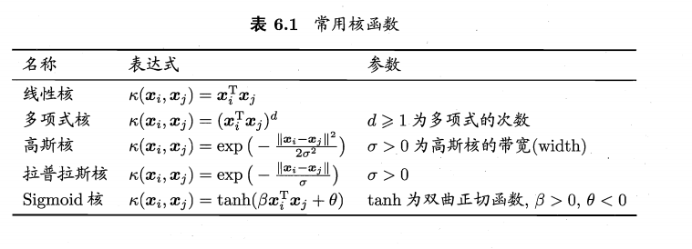
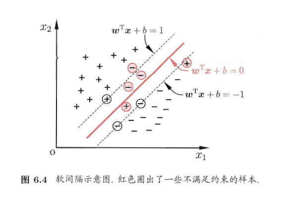
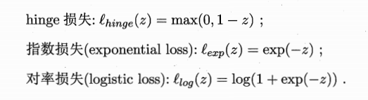
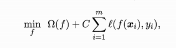

# 支持向量机

## 间隔与支持向量

划分超平面可通过如下线性方程描述
$$
\omega^Tx + b = 0
$$
$\omega$为法向量，决定超平面位置；b为位移项，决定超平面与原点之间的距离

样本空间任意点到超平面的距离为
$$
r = \frac{\omega^Tx+b}{||\omega||}
$$
令
$$
\omega^T+b>=+1,y_i =+1;  \omega^T+b<=-1,y_i =-1
$$
距离超平面最近的这几个训练点使式中等号成立，它们被成为**支持向量**

两个异类之处向量机到超平面的距离之和$\gamma = \frac{2}{||\omega||}$,被成为**间隔**

支持向量机基本型
$$
\min_{\omega. b}\frac{1}{2}||\omega||^2
$$

$$
s.t. y_i(\omega^Tx_i + b)>=1, i = 1,2,...,m
$$

## 对偶问题

$$
\max_{\alpha}\sum_{i=1}^{m}\alpha_i-\frac{1}{2}\sum_{i=1}^{m}\sum_{j=1}^{m}\alpha_i\alpha_jy_iy_jx_i^Tx_j
$$

解出$\alpha$之后求出$\omega$与b即可得到模型
$$
f(x) = \omega^Tx+b=\sum_{i=1}^{m}\alpha_iy_ix_i^Tx+b
$$

### KKT条件

$$
a_i>=0
$$

$$
y_if(x_i)-1>=0
$$

$$
\alpha_i(y_if(x_i)-1)=0
$$

### SMO算法

基本思路：固定$\alpha_i$之外的所有参数，然后求$\alpha_i$上的极值

1.  选取一堆需要更新的变量$\alpha_i$和$\alpha_j$
2.  固定$\alpha_i$和$\alpha_j$以外的参数，求解$\max_{\alpha}\sum_{i=1}^{m}\alpha_i-\frac{1}{2}\sum_{i=1}^{m}\sum_{j=1}^{m}\alpha_i\alpha_jy_iy_jx_i^Tx_j$获得更新后的$\alpha_i$和$\alpha_j$

## 核函数

线性不可分：将样本从原始空间映射到一个更高维的特征空间，使得样本在这个特征空间内线性可分

令$\phi(x)$表示将x映射后的特征向量，于是在特征空间中划分超平面所对应的模型可表示为
$$
f(x)=\omega^Y\phi(x)+b
$$
类似式（6.6）
$$
\min_{\omega. b}\frac{1}{2}||\omega||^2
$$

$$
s.t. y_i(\omega^T\phi(x_i) + b)>=1, i = 1,2,...,m
$$

对偶问题
$$
\max_{\alpha}\sum_{i=1}^{m}\alpha_i-\frac{1}{2}\sum_{i=1}^{m}\sum_{j=1}^{m}\alpha_i\alpha_jy_iy_j\phi(x_i)^T\phi(x_j)
$$
核函数
$$
\kappa(x_i,x_j)=<\phi(x_i),\phi(x_j)>=\phi(x_i)^T\phi(x_j)
$$
支持向量展式
$$
f(x)=\omega^Y\phi(x)+b = \sum_{i=1}^{m}\alpha_iy_i\phi(x_i)^T\phi(x)+b = \sum_{i=1}^{m}\alpha_iy_i\kappa(x,x_i)+b
$$
Th.令$\chi$为输入空间，$\kappa(.,.)$是定义在$\chi\times\chi$上的对称函数，则$\kappa$是核函数当且仅当对于任意数据D = {$x_1,x_2,...,x_m$}，“核矩阵”K总是半定的

若$\kappa1$和$\kappa2$为核函数，对于任意$\gamma1$和$\gamma2$其线性组合也是核函数

若$\kappa1$和$\kappa2$为核函数，则核函数的直积也是核函数

若$\kappa1$和$\kappa2$为核函数，则对于任意函数g(x)，$\kappa(x,z) = g(x)\kappa_1(x,z)g(z)$也是核函数

## 软间隔与正则化

硬间隔：所有样本都必须划分正确

软间隔：允许某些样本不满足约束条件

优化目标：
$$
\min_{\omega,b} \frac{1}{2}||\omega||^2+C\sum_{i=1}^{m}l_{0/1}（y_i(\omega^Tx_i+b)-1)
$$
C>0是一个常数,$l_{0/1}$是0/1损失函数

替代损失

### hinge损失

$$
\min_{\omega,b} \frac{1}{2}||\omega||^2+C\sum_{i=1}^{m}\max(0,1-y_i(\omega^Tx_i+b))
$$

引入松弛变量$\xi_i$>=0,则上式重写为
$$
\min_{\omega,b} \frac{1}{2}||\omega||^2+C\sum_{i=1}^{m}\xi_i
$$

### 对率损失函数替代

得到了对率回归模型。对率回归的优势是其输出具有自然的概率意义，能直接用于多分类任务；对率损失是光滑的单调递减函数，不能导出类似支持向量机的概念，因此对率回归的解依赖于更多的训练样本，其预测开销更大

 

可以用别的损失函数替代，得到其他学习模型

共性：优化目标中的第一项用来描述划分超平面的间隔大小，另一项$\sum_{i=1}^ml(f(x_i),y_i)$用来表示训练集上的误差

其中$\Omega（f)$称为结构风险，用于描述模型f的某些性质；第二项$\sum_{i=1}^ml(f(x_i),y_i)$称为经验风险，用于描述模型与训练数据的契合程度。上式成为正则化问题，$\Omega（f)$称为正则化项，C则称为正则化常熟

## 支持向量回归

SVR问题可形式化为
$$
\min_{\omega,b}\frac{1}{2}||\omega||^2 + C\sum_{i=1}^ml_{\epsilon}(f(x_i)-y_i)
$$

## 手写笔记

用latex推导太顶了，故更换手写

### 参考文献

[ CSDN Python3《机器学习实战》学习笔记（八）：支持向量机原理篇之手撕线性SVM](https://blog.csdn.net/c406495762/article/details/78072313)

《机器学习》

MOOC 《机器学习》浙江大学
